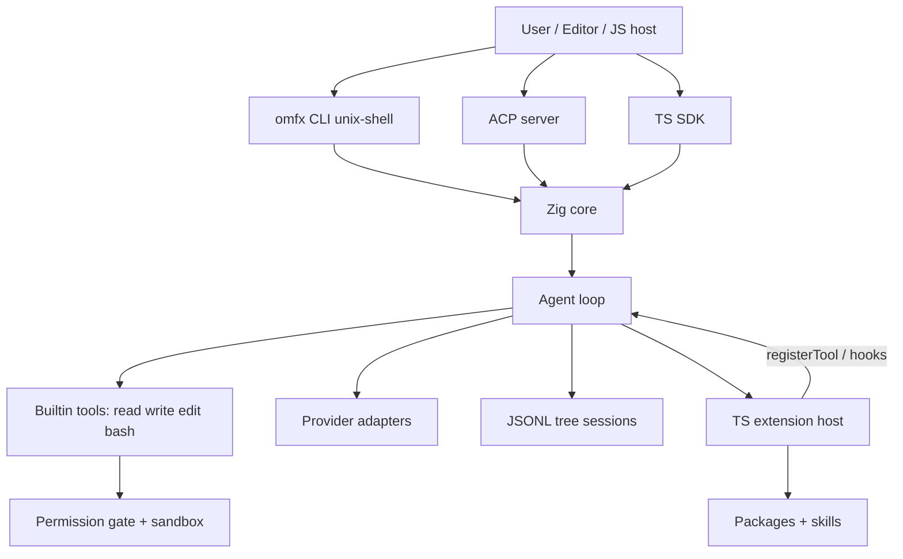
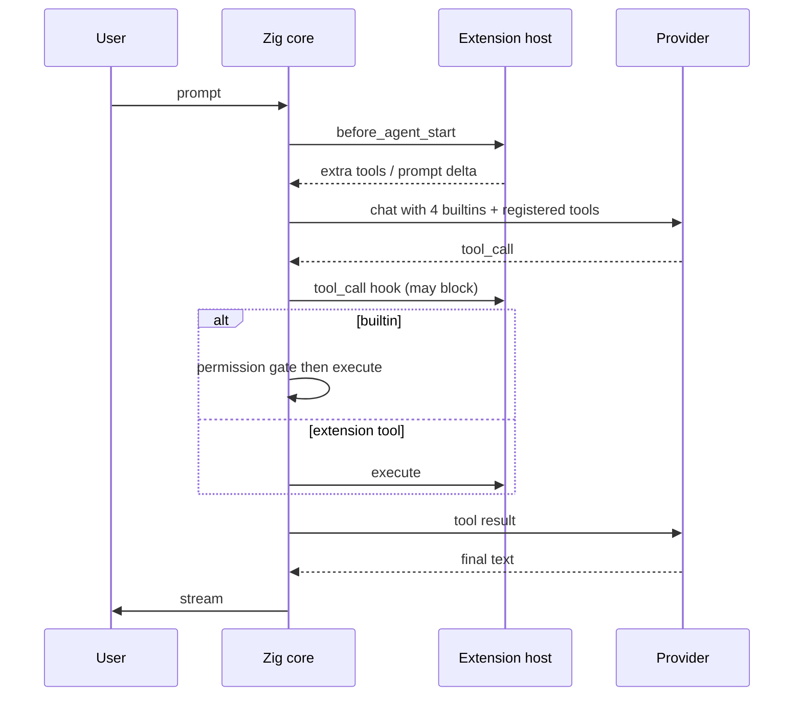

# feat: Unix-shell coding agent (Oh My Fx / omfx)

## Summary

Build a greenfield coding agent named Oh My Fx (`omfx`): Zig core, TypeScript extension host. Interactive mode is full-screen with a sticky footer. The core stays tiny (four tools, multi-provider, permissions). Landscape features from other CLIs ship as official packages, not baked-in chrome.

---

## Problem Frame

vercel-labs/fx is a ~7.8 MiB Zig coding agent that claims minimalism and model-agnosticism. In practice auth and transport are Vercel AI Gateway, the advertised tool list is large, and there is no way for a user to drop in an extension that registers tools, commands, or lifecycle hooks. The 2026 CLI field is otherwise split between lab-native TUI-IDEs (Claude Code, Codex, OpenCode, Crush, Oh My Pi) and Pi, which has the right extension ABI and provider breadth but is Node/Bun-shaped, has no core sandbox, and is not a native/WASM embed.

`omfx` exists to occupy the empty cell: native Unix-shell loop, many providers, user-authored extensions, fx-grade permissions, ACP/WASM embed. Landscape evidence is in `docs/research/2026-08-20-coding-agent-cli-landscape.md`.

---

## Requirements

### Product identity

- R1. Interactive `omfx` is full-screen (alternate screen). The transcript scrolls in the region above a footer that stays pinned at the bottom; scrolling the transcript does not move the footer. `omfx ask` and JSON/RPC stay noninteractive pipes. This is not an IDE-in-the-terminal (no file tree, no multi-pane editor, no dashboard).
- R2. The native binary stays in the same size class as fx (single-digit MiB release). The surface is a two-region layout (scrollable transcript + sticky footer), not Crush/OpenCode chrome.
- R3. The project is greenfield. It does not fork vercel-labs/fx. It may read fx as prior art.
- R20. Footer contents: composer, active model, permission mode, context meter. Resize keeps the footer on the last rows of the terminal.
- R21. Features that exist across the landscape (MCP, web fetch/search, browser, subagents, LSP, git auto-commit, plan mode, vision) are available as official or community packages. They are not compiled into the default tool advertisement. Installing a package is how `omfx` "covers" those CLIs without becoming them.

### Providers

- R4. Users authenticate with a provider API key or OAuth without a Vercel account. Vercel AI Gateway is one backend among many, not the only transport.
- R5. v1 ships first-class adapters for OpenAI-compatible chat/completions (covers Groq, Fireworks, Together, OpenRouter, Ollama, vLLM, LM Studio, llama.cpp), Anthropic Messages, Google Generative Language, and xAI, plus a documented way to add a custom OpenAI-compat endpoint.
- R6. The active model can change mid-session without wiping history. Provider-specific extras that cannot round-trip across vendors stay out of the session core.

### Core loop

- R7. The system prompt advertises four tools: `read`, `write`, `edit`, `bash`. Additional tools enter via extensions or explicit lazy builtins, not by growing the default advertisement.
- R8. One-shot `omfx ask "..."` and interactive `omfx` both run the same loop, permissions, and workspace rules.
- R9. Compaction is explicit and hookable. Sessions are append-only JSONL with branch/rewind, not a single linear blob that extensions cannot annotate.

### Extensions (Pi-shaped)

- R10. Any user can add a TypeScript extension by placing a file under `~/.omfx/extensions/` or `.omfx/extensions/` (project, after trust). No maintainer patch is required.
- R11. Extensions can register tools, slash commands, and lifecycle hooks (at least: session start, before model call, tool call with block, tool result, session end). The agent can write an extension, `/reload`, and use it in the same session.
- R12. Packages install from npm or git (`omfx install npm:…` / `git:…`) and may bundle extensions, skills, and prompts. Third-party packages run with user authority and must be trust-gated.
- R13. Skills follow the Agent Skills standard with progressive disclosure. Discovery includes `skills/`, `.agents/skills/`, and compatibility roots used by Claude Code / Codex / Pi / fx.

### Safety and embed

- R14. Sensitive tools pass a permission gate (`ask` default, `yolo` opt-in). Persistent allow/deny rules live in the user profile, never in a cloned repo config that executes on clone.
- R15. Allowed commands still run inside an OS sandbox where the host supports it (macOS first). `yolo` is process-scoped and does not rewrite saved sandbox settings.
- R16. `omfx acp` speaks Agent Client Protocol so editors can host the same core. A TypeScript SDK embeds the core (native addon or WASM) for JS hosts.

### Success criteria

- R17. A user with only an Anthropic or OpenAI key can complete a repo edit without Vercel.
- R18. A user can drop `~/.omfx/extensions/hello.ts`, `/reload`, and have the model call a new tool in that session.
- R19. `omfx ask "list the Zig files in this repo"` works noninteractively and respects permission mode.

---

## Key Technical Decisions

KTD1. **Zig core, TypeScript extension host.** The loop, tools, providers, permissions, sessions, ACP, and WASM live in Zig so the binary stays native. Extensions are TypeScript loaded by a small host (Bun or a constrained JS runtime spawned by Zig, or in-process via a WASM JS sandbox later). v1 uses an out-of-process extension host over a length-prefixed JSON RPC so a bad extension cannot crash the core. Rationale: fx is Zig-only and cannot take user plugins; Pi is TS-only and cannot ship an 8 MiB native. Split the difference.

KTD2. **Four advertised tools.** Copy Pi's `read` / `write` / `edit` / `bash`. Grep, glob, web, browser, subagents, MCP are packages or lazy builtins. Rationale: long tool descriptions are the main prompt-tax in fx and Claude Code; Pi and research harnesses show a short set still works.

KTD3. **Providers in-process, not behind one gateway.** Zig implements OpenAI-compat, Anthropic Messages, and Google as first-class HTTP clients. A gateway (OpenRouter, Vercel AI Gateway, LiteLLM) is configured as an OpenAI-compat base URL. Rationale: fx's "model-agnostic" is Gateway-shaped; Pi/OpenCode already prove direct adapters.

KTD4. **Permissions stay in core.** Unlike Pi, `omfx` does not wait for an extension to invent a permission prompt. Extensions may add extra gates (`tool_call` block) but cannot widen the sandbox. Rationale: landscape shows Pi users told to containerize; fx/Codex users expect a gate.

KTD5. **MCP is a package, not a core prompt citizen.** Ship an official `omfx-mcp` extension that lazy-discovers tools (fx's search/select pattern). Core never dumps a 40-tool MCP catalog into the system prompt. Rationale: Pi omits MCP on purpose; fx's lazy MCP is the right compromise.

KTD6. **Full-screen two-region surface.** Enter the alternate screen. Transcript is a scrollable region; footer is a fixed-height band at the bottom that does not scroll. Implementation is a small region layout (cursor addressing + scroll region), not a widget library, not Doom, not a file tree. `omfx ask` never enters the alt screen. Rationale: user asked for sticky footer by default; still refuse IDE chrome.

KTD10. **Cover the field via packages, not core.** Map landscape features to installable packages (see Feature coverage). Core wins on loop, providers, extensions, permissions, and the sticky-footer surface. Official packages may include `omfx-mcp`, `omfx-web`, `omfx-git` (Aider-style commits), `omfx-subagent`, `omfx-browser`. v1 ships the ABI plus `omfx-mcp`; the rest follow without growing the default prompt.

KTD7. **Trust model for project extensions.** Global extensions load always. Project `.omfx/extensions` and project packages load only after an explicit trust prompt, remembered per directory. Repo MCP/config cannot auto-execute on clone. Rationale: fx's `~/.fx/mcp.json`-only rule and Pi's `project_trust` event.

KTD8. **Oh My Pi is the anti-pattern.** Compatible extension ABI is in; baking LSP, browser, Python, and subagents into core is out. Those ship as packages if at all.

KTD9. **Zig 0.16 and a TypeScript SDK package.** Match fx's current Zig floor so WASM/N-API recipes stay current. The SDK is TypeScript because hosts are JS; the core is not rewritten in TS.

---

## High-Level Technical Design





Extension ABI (directional, not a spec): a default export receives `registerTool`, `registerCommand`, `on(event)`, and a context with `ui.confirm`, `reload`, and session append. Events at minimum: `session_start`, `before_agent_start`, `tool_call`, `tool_result`, `session_shutdown`.

---

## Output Structure

```
omfx/
  build.zig
  build.zig.zon
  AGENTS.md
  README.md
  src/
    main.zig
    core/          # loop, sessions, permissions, config
    providers/     # openai_compat, anthropic, google, xai
    tools/         # read, write, edit, bash
    cli/           # interactive + ask + install
    acp/           # ACP JSON-RPC
    ext/           # extension host protocol
  extensions/      # TS host + official packages (mcp, optional)
  sdk/             # TypeScript embed (native/WASM)
  tests/
  docs/
    research/      # landscape doc already written
    plans/
```

The tree is a scope declaration. Implementers may adjust names if a cleaner layout appears.

---

## Implementation Units

### U1. Scaffold and contracts

- **Goal:** A Zig 0.16 project that builds `omfx --help`, plus documented contracts for workspace, config dirs, and permission modes.
- **Requirements:** R1, R2, R3
- **Dependencies:** none
- **Files:** `build.zig`, `build.zig.zon`, `src/main.zig`, `src/core/config.zig`, `AGENTS.md`, `README.md`, `tests/cli_help.zig`
- **Approach:** Empty-repo greenfield. Config root `~/.omfx/`. Workspace is cwd. No Vercel login. No UI framework.
- **Patterns to follow:** fx `AGENTS.md` composition-root rule (`src/main.zig` does not own features); Unix flag kebab-case.
- **Test scenarios:**
  - Happy path: `zig build` produces `zig-out/bin/omfx`; `omfx --help` lists `ask`, `acp`, `install`.
  - Edge: unknown subcommand exits non-zero with a one-line error, no stack trace.
  - Error: missing Zig 0.16 fails at build, not at runtime.
- **Verification:** Help text exists; binary runs without network.

### U2. Provider adapters

- **Goal:** Stream a chat completion from at least OpenAI-compat, Anthropic, Google, and xAI using env keys.
- **Requirements:** R4, R5, R6, R17
- **Dependencies:** U1
- **Files:** `src/providers/mod.zig`, `src/providers/openai_compat.zig`, `src/providers/anthropic.zig`, `src/providers/google.zig`, `src/providers/xai.zig`, `src/providers/types.zig`, `tests/providers_parse.zig`, `tests/providers_live.zig`
- **Approach:** One internal stream event type (text delta, tool call, error). Map each vendor JSON onto it. Custom OpenAI-compat is base URL + key + model id. Do not call Vercel unless the user set that base URL.
- **Execution note:** Parse fixtures test-first; live tests gated on env keys.
- **Test scenarios:**
  - Happy path: fixture SSE/JSON for each vendor yields the same internal events.
  - Edge: mid-session model switch keeps prior messages in the vendor-neutral session schema.
  - Error: 401 from a vendor surfaces as an auth error naming that vendor, not a generic gateway failure.
  - Integration: with `OPENAI_API_KEY` or `ANTHROPIC_API_KEY`, a one-token round trip succeeds without other credentials.
- **Verification:** Unit tests pass offline; one live adapter proven when a key is present.

### U3. Agent loop and four tools

- **Goal:** The model can read, write, edit, and bash inside the workspace under a hard iteration cap.
- **Requirements:** R7, R8, R19
- **Dependencies:** U1, U2
- **Files:** `src/core/loop.zig`, `src/tools/read.zig`, `src/tools/write.zig`, `src/tools/edit.zig`, `src/tools/bash.zig`, `src/core/prompt.zig`, `tests/tools_fs.zig`, `tests/loop_turn.zig`
- **Approach:** Exact-string `edit` like fx/Pi. `bash` captured, not a PTY, in v1. System prompt stays short and lists only the four tools plus discovered skill names.
- **Test scenarios:**
  - Happy path: given a temp workspace with `a.txt`, the loop can read it and write `b.txt`.
  - Edge: `edit` with a non-unique `old_string` fails without writing.
  - Error: path escape (`../` outside workspace) is denied before IO.
  - Integration: mocked provider that emits `read` then text completes one turn.
- **Verification:** Tool tests pass without network; prompt snapshot does not list MCP or web tools.

### U4. Full-screen CLI, sticky footer, and `ask`

- **Goal:** Interactive `omfx` uses the full terminal with a pinned footer; `omfx ask` shares the loop without the alt screen.
- **Requirements:** R1, R2, R8, R19, R20
- **Dependencies:** U3
- **Files:** `src/cli/interactive.zig`, `src/cli/surface.zig`, `src/cli/ask.zig`, `src/cli/status.zig`, `tests/ask_cli.zig`, `tests/surface_layout.zig`
- **Approach:** On interactive start, enter the alternate screen. Set a DECSTBM scroll region for the transcript rows; footer occupies the last N rows (composer + one status line: model, permission, context). Mouse/keyboard scroll and transcript append only move the scroll region. SIGWINCH recomputes regions and redraws the footer in place. `omfx ask` never calls the surface. No file tree, no extra panes.
- **Test scenarios:**
  - Happy path: layout for 24x80 yields transcript rows 1-21 and footer rows 22-24; after 100 transcript lines the footer row numbers are unchanged.
  - Edge: resize 24x80 → 12x40 keeps footer on the last rows; composer does not clip off-screen.
  - Edge: `omfx ask` stdout is a plain stream (no alt-screen / CSI ?1049).
  - Error: no provider configured prints how to set a key, not a Vercel login URL.
  - Integration: SIGINT aborts the in-flight request and restores the terminal on exit.
- **Verification:** Headless layout tests pass. Manual: footer stays put while the transcript scrolls.

### U5. Permissions and sandbox

- **Goal:** Sensitive calls are gated; bash is sandboxed on macOS.
- **Requirements:** R14, R15
- **Dependencies:** U3, U4
- **Files:** `src/core/permissions.zig`, `src/core/sandbox.zig`, `tests/permissions.zig`, `tests/sandbox_macos.zig`
- **Approach:** Modes `ask` | `yolo`. `write`/`edit`/`bash` are sensitive; `read` in-workspace is not. Persistent rules in `~/.omfx/settings.json`. No second-model auto-reviewer. Sandbox: macOS seatbelt/sandbox-exec equivalent; elsewhere `none` with a status warning.
- **Test scenarios:**
  - Happy path: `ask` mode on `write` without a TTY in `omfx ask` fails closed.
  - Edge: session grant "don't ask again" applies only to the displayed scope, not all bash.
  - Error: yolo does not persist after process exit.
  - Integration: macOS sandbox allows writes in workspace and denies writes to `$HOME/unrelated`.
- **Verification:** Permission tests pass on all hosts; sandbox test skipped off macOS.

### U6. Sessions, compaction, doctor

- **Goal:** Resume, branch, compact, and inspect runtime without a TUI screen.
- **Requirements:** R9, R16 (status/doctor portion)
- **Dependencies:** U3
- **Files:** `src/core/session.zig`, `src/core/compact.zig`, `src/cli/doctor.zig`, `tests/session_jsonl.zig`
- **Approach:** JSONL tree (Pi-like entries, including extension-private entries that are not sent to the model). `omfx resume last`. Compaction is a session event extensions can hook later in U7.
- **Test scenarios:**
  - Happy path: two turns persist; resume replays them.
  - Edge: branch from message N, original branch still loadable.
  - Error: truncated JSONL loads up to the last valid entry and reports the rest.
- **Verification:** `omfx doctor` prints model, permission mode, sandbox, extension host status.

### U7. TypeScript extension host and packages

- **Goal:** Users add extensions; the agent can write one and `/reload`; packages install from npm/git.
- **Requirements:** R10, R11, R12, R18
- **Dependencies:** U3, U4, U6
- **Files:** `src/ext/protocol.zig`, `src/ext/host.zig`, `extensions/host/index.ts`, `extensions/host/api.ts`, `extensions/examples/hello.ts`, `src/cli/install.zig`, `tests/ext_reload.zig`, `extensions/host/api.test.ts`
- **Approach:** Zig spawns the host. Handshake advertises ABI version. Host loads `~/.omfx/extensions/` and trusted project `.omfx/extensions/`. `/reload` restarts the host without killing the session. `omfx install` writes to user settings and fetches into `~/.omfx/packages/`. Project packages wait on trust (KTD7).
- **Execution note:** Host protocol fixtures test-first before wiring live Bun/Node.
- **Test scenarios:**
  - Happy path: `hello.ts` registers tool `greet`; mocked model calls it; result returns.
  - Edge: `/reload` after editing the file picks up the new tool name without dropping session messages.
  - Error: extension `throw` at load disables that extension, logs a path, does not crash `omfx`.
  - Error: untrusted project extension is not loaded until trust is recorded.
  - Integration: `omfx install` of a local package directory loads its bundled skill and extension.
- **Verification:** Documented example works as R18.

### U8. Skills, official MCP package, ACP, SDK stub

- **Goal:** Skills discover and load on demand; MCP is an official package; ACP speaks initialize/session/prompt; SDK package exists as a typed client even if WASM lands thin.
- **Requirements:** R13, R16, KTD5
- **Dependencies:** U5, U7
- **Files:** `src/core/skills.zig`, `extensions/packages/omfx-mcp/`, `src/acp/server.zig`, `sdk/package.json`, `sdk/src/index.ts`, `tests/skills.zig`, `tests/acp.zig`
- **Approach:** Skills: names+descriptions in prompt, body via `read`. MCP package uses lazy search/select. ACP: protocol version 1 methods used by fx (`initialize`, `session/new`, `session/prompt`, `session/cancel`). SDK: `createOmfxAgent()` calling native or spawning `omfx acp`. Full WASM core may trail native ACP in this unit.
- **Test scenarios:**
  - Happy path: a `SKILL.md` in `~/.omfx/skills/` appears in the advertised skill list; invoking it injects the body.
  - Edge: malformed frontmatter is skipped with a warning; siblings still load.
  - Error: ACP without a provider credential fails initialize with a structured error.
  - Integration: a fake MCP server behind the official package exposes one tool only after search/select, not at session start.
- **Verification:** `omfx acp` negotiates initialize against a fixture client; README documents SDK install.

---

## Acceptance Examples

- AE1. Covers R17.
  - **Given:** only `ANTHROPIC_API_KEY` is set
  - **When:** `omfx ask "create hello.txt with hi"` in a temp workspace with yolo for the test
  - **Then:** `hello.txt` exists and no Vercel login was required
- AE2. Covers R18 / R11.
  - **Given:** `~/.omfx/extensions/hello.ts` registers tool `greet`
  - **When:** the user `/reload`s and asks the agent to greet
  - **Then:** the tool runs in that same session
- AE3. Covers R14 / R15.
  - **Given:** permission mode `ask` and no TTY
  - **When:** `omfx ask` needs `write`
  - **Then:** the process exits without writing
- AE4. Covers R7 / KTD5.
  - **Given:** no MCP package installed
  - **When:** a session starts
  - **Then:** the advertised tools are only `read`, `write`, `edit`, `bash` plus any user extensions
- AE5. Covers R10 / KTD7.
  - **Given:** a cloned repo containing `.omfx/extensions/evil.ts`
  - **When:** `omfx` starts in that repo for the first time
  - **Then:** the extension does not load until the user trusts the project
- AE6. Covers R1 / R20.
  - **Given:** an 80x24 interactive session with more transcript lines than the viewport
  - **When:** the user scrolls the transcript
  - **Then:** the footer (composer + status) stays on the bottom rows

---

## System-Wide Impact

- Auth secrets stay in env / `~/.omfx/auth.json` mode 0600, never in project files.
- Extension code is equivalent to installing a local binary. Trust UI and README must say so.
- ACP clients inherit the same permission mode; they must be able to answer approval requests.
- Skill discovery from other harness directories is read-only and must not write into `~/.claude` or `~/.pi`.

---

## Scope Boundaries

### In

- Greenfield Zig + TypeScript as above
- Pi-style user extensions and packages
- Multi-provider core
- Full-screen interactive surface with sticky footer; `ask` + ACP as pipes
- Permissions + macOS sandbox
- Official packages that cover landscape features without baking them into core

### Deferred to Follow-Up Work

- Full WASM `omfx-core.wasm` / `omfx-term.wasm` parity with fx (SDK stub in U8, native ACP first)
- Official packages after `omfx-mcp`: web, browser, subagents, LSP, git auto-commit, plan mode, vision
- Windows sandbox equivalent
- Auto permission-review model (explicitly rejected as a default)
- Desktop app

### Outside this product's identity

- IDE-in-the-terminal (file tree, multi-pane editor, dashboard)
- Fork of vercel-labs/fx
- Vercel-account-required inference
- Oh My Pi-style feature bake-in

---

## Feature coverage (landscape → packages)

Keep the core small. Cover other CLIs by making their distinctive features installable.

| Landscape feature | Who has it | omfx home |
| --- | --- | --- |
| Four-tool loop | Pi | core |
| Multi-provider + mid-session switch | Pi, OpenCode, Aider | core |
| User TypeScript extensions + hot reload | Pi | core |
| Sticky full-screen footer | Pi, fx, Claude Code | core surface |
| Permissions + OS sandbox | fx, Codex | core |
| ACP / editor embed | fx, Cursor CLI | core |
| MCP | fx, Claude Code, Goose, OpenCode | package `omfx-mcp` (v1) |
| Web fetch/search | fx, Claude Code | package `omfx-web` |
| Git auto-commit | Aider | package `omfx-git` |
| Subagents | Claude Code, fx, Oh My Pi | package `omfx-subagent` |
| Browser | Cline, Oh My Pi | package `omfx-browser` |
| LSP | OpenCode, Oh My Pi | package `omfx-lsp` |
| Plan mode | Claude Code, Oh My Pi | package or skill |
| Hash-anchored edits | Oh My Pi | optional edit package |
| Tree sessions | Pi | core |

---

## Risks and Dependencies

- **Extension host runtime.** Bun vs Node vs embedded JS is an execution-time choice. The protocol (KTD1) is the stable bit. If spawning a runtime is too heavy for the size budget, fall back to loading compiled extension WASM later without changing the TS API.
- **Provider protocol drift.** Vendor streams change. Fixture tests in U2 are the mitigation; live tests are opt-in.
- **Sandbox portability.** Linux landlock/seccomp is not v1. Doctor must say so.
- **Trust UX.** Getting project-extension trust wrong either bricks collaboration or becomes a remote-code vector. Default deny + remember-yes, same as Pi `project_trust`.
- **Package supply chain.** `omfx install npm:` / `git:` executes third-party TypeScript with user authority. Install is explicit, project autoload waits on trust, and the CLI must print the resolved source before fetching.
- **Zig 0.16.** fx already requires it; pin in `build.zig.zon` and document the download.

---

## Sources and Research

Load-bearing: `docs/research/2026-08-20-coding-agent-cli-landscape.md` (127 CLIs, C-IDs). Especially C1 fx, C2 Pi, C3 Oh My Pi, C5 Claude Code, C6 Codex, C9 OpenCode.

Primary: [pi.dev extensions](https://pi.dev/docs/latest/extensions), [pi.dev providers](https://pi.dev/docs/latest/providers), [fx permissions](https://fx.sh/docs/configure-fx/permissions), [fx auth](https://fx.sh/docs/getting-started/authentication), [fx ACP](https://fx.sh/docs/using-fx/acp), [Ronacher on Pi](https://lucumr.pocoo.org/2026/1/31/pi).
